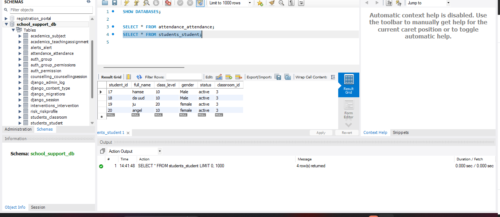

# School Early Warning Support System

## Description

The School Early Warning Support System is a full-stack web application designed to assist schools in monitoring student attendance, identifying early academic risk indicators, and supporting structured intervention workflows between teachers, counselors, and administrators.

The system enables data-driven educational decision-making by combining a secure backend API, a modern frontend interface, and a relational database designed to support future analytics, alerts, and intervention management.

---

## Technology Stack

- Frontend: React (Vite) with Tailwind CSS
- Backend: Django REST Framework
- Database: MySQL
- Authentication: JWT-based authentication
- Architecture: Three-tier full-stack architecture

---

## GitHub Repository

https://github.com/Khaalid245/somali-early-warning-system-school

---

## Project Structure

```
somali-early-warning-system-school/
│
├── somali-early-warning-system/
│   ├── .venv/
│   ├── school_support_backend/
│   ├── school_support_frontend/
│   ├── screenshots/
│   └── README.md
│
└── README.md
```

---

## Prerequisites

### Required Software Versions

- Python 3.11+
- Node.js 18+
- npm 9+
- MySQL Server 8.0+
- Git 2.x

---

## Environment Setup (Windows)

### 1. Clone the Repository

```bash
git clone https://github.com/Khaalid245/somali-early-warning-system-school.git
cd somali-early-warning-system-school/somali-early-warning-system
```

---

### 2. Create Virtual Environment

```powershell
python -m venv .venv
```

### 3. Activate Virtual Environment

```powershell
.venv\Scripts\activate
```

---

## Backend Setup (Django REST Framework)

### 4. Install Backend Dependencies

```bash
cd school_support_backend
pip install -r requirements.txt
```

---

### 5. Environment Variables Configuration

Create a `.env` file inside `school_support_backend`:

```env
DB_NAME=school_support_db
DB_USER=django_user
DB_PASSWORD=your_password
DB_HOST=localhost
DB_PORT=3306
SECRET_KEY=your_secret_key
DEBUG=True
```

Ensure Django loads environment variables using `python-dotenv` or `os.environ`.

---

### 6. Database Creation

Create the database in MySQL:

```sql
CREATE DATABASE school_support_db;
```

---

### 7. Run Migrations

```bash
python manage.py migrate
```

---

### 8. Start Backend Server

```bash
python manage.py runserver
```

Backend URL:

```
http://127.0.0.1:8000/
```

---

## Frontend Setup (React)

```bash
cd ../school_support_frontend
npm install
npm run dev
```

Frontend URL:

```
http://localhost:5173/
```

---

## Usage Guide

1. Access the frontend at `http://localhost:5173/`
2. Log in as a teacher (authentication enabled)
3. Register and manage students
4. Record daily attendance
5. View attendance records linked to students
6. (Planned) View alerts and risk indicators

---

## API Overview

| Method | Endpoint           | Description                 |
| ------ | ------------------ | --------------------------- |
| POST   | /api/auth/login    | User login                  |
| POST   | /api/auth/register | User registration           |
| GET    | /api/students      | Retrieve students           |
| POST   | /api/students      | Create student              |
| GET    | /api/attendance    | Retrieve attendance records |
| POST   | /api/attendance    | Record attendance           |

---

## System Architecture

The system follows a three-tier architecture:

- Presentation Layer: React frontend
- Application Layer: Django REST API
- Data Layer: MySQL relational database


---

## Designs

### Figma Mockups

https://www.figma.com/design/Wm6KJwRO8ORANAFwRMx7t8/Untitled?node-id=0-1&t=kA82b1tj4S0sL9Dw-1

## Screenshots

Screenshots are located in the `screenshots/` directory:

## Screenshots

Screenshots are located in the `screenshots/` directory:

## Screenshots

### Login Interface


### Teacher Dashboard


### Attendance Interface


### Database Schema



### System Architecture


- Database schema (MySQL Workbench)

---

## Deployment Plan

### Current Deployment

- Local deployment using MySQL, Django REST Framework, and React
- All services run on localhost for development and testing

### Production Deployment Strategy

1. Frontend built using `npm run build`
2. Static files served via Nginx
3. Backend deployed using Gunicorn
4. Application containerized with Docker
5. MySQL hosted as managed cloud service
6. CI/CD pipeline for automated deployment

---

## Project Status

### Completed

- Backend API architecture
- Database schema and migrations
- JWT authentication
- Attendance recording
- Frontend-backend integration

### Planned

- Counselor dashboards
- Administrator panels
- Risk and alert visualizations
- Intervention management
- UI improvements and testing
- Cloud deployment

---

---

## License

Developed for academic purposes.
